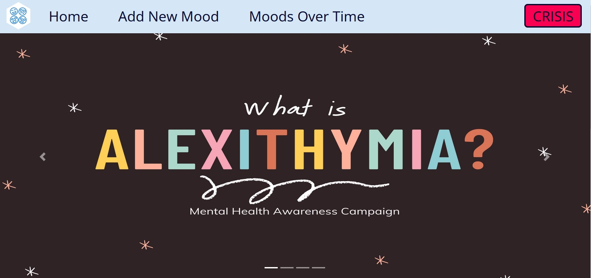
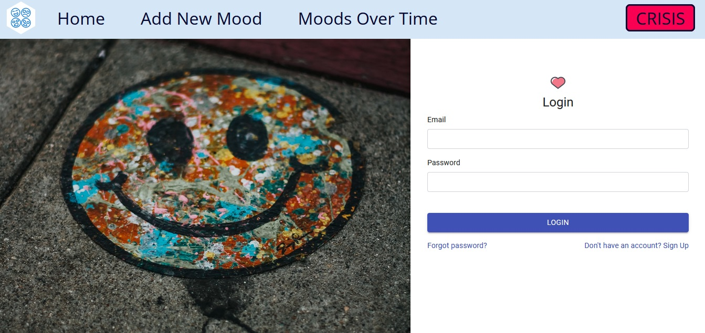
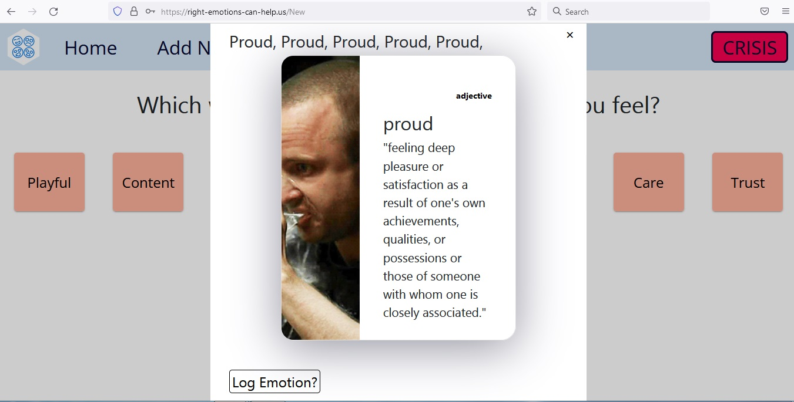

## This is a project for Major League Hacking - Mental Hacks Hackathon
## http://right-emotions-can-help.us/
# Project overview 

App for people with alexithymia and others who have trouble expressing and describing emotions and feelings.

### Screenshots
1. Home Page

2. login

3. new mood

4. proud

# 💡 Inspiration

Alexithymia is a trait (not a disorder!) that describes problems with feeling emotions. The Greek word loosely translates to "no words for emotion" because oftentimes, those with alexithymia have trouble describing and expressing their emotions. For example, they have trouble expressing happiness during a joyous occasion. Others have trouble even just understanding what they're feeling. While the condition is not well-known, it’s estimated that 1 in 10 people has it. We hope that this project helps alleviate the difficulties faced by people with alexithymia and the greater population as a whole in describing and expressing their emotions.

# ⚙ What it does
The user, after creating an account or logging in, will go through a series of multiple-choice questions asking them which word best represents how they feel. This is based on a color-coded emotion wheel often used in therapy. The emotion that they choose is logged and is then displayed on another page. This log of emotions is accompanied by a chart that visualizes positive vs negative emotions over time.

# 🔧 How we built it
We used React.js for our frontend and Firebase + Firestore for our backend. Firebase was our user authentication and hosting, while Firestore was our database.

## 💪 Challenges we ran into
We had trouble integrating Firestore and storing the user's input there.
We were in as many as three different timezones, which made keeping in sync initially difficult.

## 📌 Accomplishments that we're proud of
We eventually delegated work effectively, which made development smooth but also made sure we didn't have merge conflicts when updating the repository. We pair programmed and collaborated seamlessly.
We created a fully functioning, complete full-stack project in just a weekend!! 🥳

## 📚 What we learned
None of us knew how to use Firebase for auth (one only knew hosting) and none of us knew how to use Firestore. It took a lot of reading documentation and googling and collaborating to finally get these to work.
We got better at using React through practice. Particularly, some team members learned how to do more advanced functionality.
We learned how to maintain teamwork even when half the team was inactive during a particular time due to being in a different location.

## ⏭ What's next for Alexithymia
- We need to fix minor bugs like deployment and inaccurate GIFs.
- We need to clean up our code to adhere to industry best practices.
- We can improve styling and user experience.
- We can consider other features to add.
